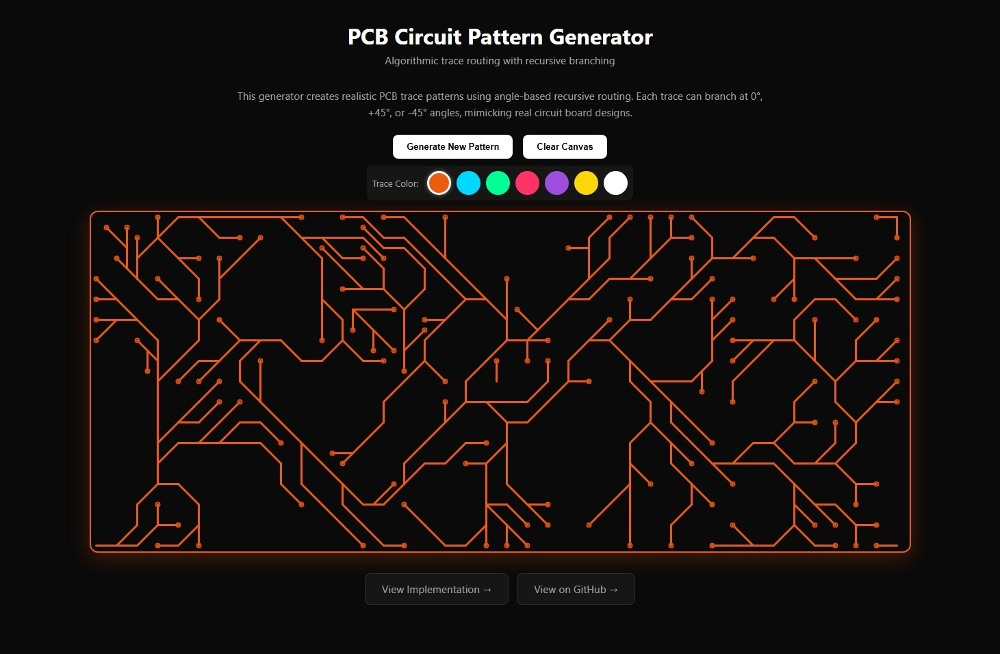

# Circuit Pattern Generator

Generate customizable circuit patterns for use in design, visualization, or educational projects.

## Features
- Procedural generation of circuit-like patterns
- Customizable parameters for pattern complexity and style
- Export or use generated patterns in your own projects
- **Zero dependencies** – no external libraries required

## Installation

Clone the repository:

```sh
git clone https://github.com/ACherniske/Circuit-Pattern-Generator.git
cd Circuit-Pattern-Generator
```

## Usage


You can use the generator in your HTML page as follows:

```sh
<!-- Add an SVG element -->
<svg id="pcb-canvas" width="800" height="600"></svg>

<script>
	// Create generator instance
	const generator = new CircuitGenerator('pcb-canvas', {
		gridSpacing: 15,
		lineWidth: 3,
		lineColor: '#EF5B0C',
		padColor: '#DC4E08',
		branchProbability: 0.7
	});
  
	// Generate pattern with 3 start points
	generator.generate(3);
</script>
```

### Example Output


Below are sample generated patterns:

<p align="center">
	
	
</p>

See the `examples/screenshots/` directory for more samples.

**Live Example:** [acherniske.github.io](https://acherniske.github.io) - Hero Section Reveal Animation

**Live Demo:** [Demo link](http://acherniske.github.io/circuit-pattern-demo.html)

## Contributing

Pull requests are welcome! For major changes, please open an issue first to discuss what you would like to change.

## Credits

Inspired by the original [PCB-Circuit_Generator](https://github.com/sch0penheimer/PCB-Circuit_Generator) by sch0penheimer.

## License

This project is licensed under the MIT License. See the [LICENSE](LICENSE) file for details.
